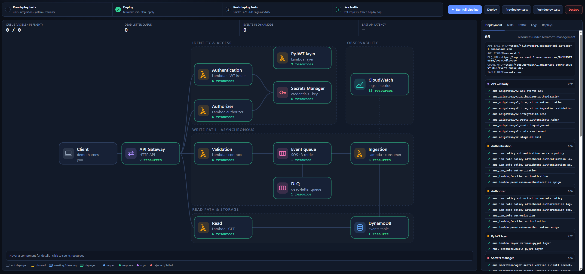

# Event Platform Service

Internal platform service providing a centralized capability to ingest,
persist, and expose immutable operational events.

## Overview

This repository contains the documentation and reference implementation of an
internal, serverless, cloud-native platform service used to collect and
retrieve immutable operational events emitted by multiple systems.

The service acts as an authoritative store for accepted events and is designed
to simulate a real-world internal platform deployed in a cloud environment.
Business logic and domain-specific processing are intentionally out of scope.

## Architecture Overview

A high-level view of the deployed system and its main components
can be found here:

👉 [AWS System Architecture Map](docs/architecture/aws-service-mapping.md#aws-system-architecture-map.md)

## Features

- Immutable event ingestion and storage
- Dedicated read and write APIs
- Authentication and authorization layer
- Traffic control and request throttling
- Decoupled ingestion pipeline with validation layer and asynchronous processing via SQS
- Automatic retry mechanism with Dead Letter Queue (DLQ) for failed events
- Serverless architecture on AWS
- DynamoDB persistence layer
- Infrastructure provisioning with Terraform
- CloudWatch logging and technical metrics
- Testing strategy covering unit, integration, and end-to-end tests
- CI checks including linting, formatting, and automated test execution
- Architecture Decision Records (ADRs)

### Explicitly out of scope

- Production-grade deployment hardening
- Fully automated CI/CD pipelines
- Advanced scalability or performance tuning
- Multi-environment or multi-account AWS setups

## Repository Structure

```
infra/              # Infrastructure as Code (Terraform)
  envs/
    dev/            # Development environment entry point
    prod/           # Support production environment
docs/               # Architecture, API contracts, and design decisions
app/                # Application code (Lambda functions)
tests/              # Unit, integration, and end-to-end tests.
demo/               # Local demo UI (deploy, tests and live traffic in the browser)
run.sh              # Quick start script
```

## Documentation

All project documentation is centralized under the `/docs` directory.

Start with [`docs/README.md`](docs/README.md), which provides a guided entry
point and links to all architecture, API, infrastructure, CI, testing, and
design decision documentation.


## Getting Started

This project can be deployed to AWS using Terraform.
The recommended entry point is the development environment.

### Prerequisites

- AWS account
- AWS credentials configured locally
- Terraform >= 1.14.4.
- An existing S3 bucket named `cloud-events-terraform-state` for Terraform remote state storage.
- **Docker installed** (required to run end-to-end tests)

> No need to run `terraform init` or `terraform apply` manually—everything is handled by `./run.sh`.  

### Environment variables

Post-deploy tests and the demo UI read the deployment's endpoints from a `.env` file
(see [`.env.example`](.env.example)). `./run.sh deploy` creates it automatically from
the Terraform outputs, so usually there is nothing to do.

If the platform is already deployed and `.env` is missing, create it by hand:

```bash
cp .env.example .env
terraform -chdir=infra/envs/dev output   # copy each value into .env
```

## Usage

All project operations are done via `run.sh` from the **project root**:

| Command | Description |
|---------|-------------|
| `./run.sh deploy` | Deploy the system to AWS |
| `./run.sh test` | Run the system deployed tests. |
| `./run.sh destroy` | Destroy the system in AWS |

---

## Examples

1. **Deploy only:**

```bash
./run.sh deploy
```

2. **Run post-deploy tests:**

```bash
./run.sh test
```

3. **Destroy the system:**

```bash
./run.sh destroy
```


**Note:** If you encounter issues in **2**. Try adding your user to the `docker` group.

```bash
sudo usermod -aG docker $USER
```

## Demo UI

A local web UI that runs the same lifecycle as `run.sh` (tests, deploy, destroy)
from the browser and animates it on the architecture diagram, plus live traffic
traced hop by hop through API Gateway, Lambdas, SQS and DynamoDB.



### Start it

From Linux/WSL at the project root (same prerequisites as above, plus Python 3.11):

```bash
./demo/start.sh
```

Open **http://localhost:8000**. The first start creates `demo/.venv` and installs
dependencies. Stop it with `Ctrl+C`.

### Use it

On load, the UI reads the Terraform state and shows what is currently deployed.

| Action | Where | What happens |
|--------|-------|--------------|
| Run everything | **Run full pipeline** | Pre-deploy tests → deploy → post-deploy tests, stopping at the first failure |
| Deploy | **Deploy** | `terraform apply`; each component goes *planned → creating → deployed* on the diagram (**Deployment** tab lists every resource) |
| Test | **Pre-deploy tests** / **Post-deploy tests** | Runs `tests/pre_deploy` (local, mocked AWS) or `tests/post_deploy` (real AWS); results stream into the **Tests** tab |
| Send traffic | **Traffic** tab → **Send** | Real requests against the API; packets show each hop, and the inspector shows requests, responses and correlation IDs |
| Tear down | **Destroy** | `terraform destroy` (asks for confirmation) |
| Replay | **Replays** tab | Re-plays any recorded job or scenario without calling AWS |

Hover a component for a description, click it to see its Terraform resources.
**Cancel** stops the running job.

The traffic scenarios live in [`demo/scenarios.py`](demo/scenarios.py) and are a
visual walkthrough, separate from the test suites in `tests/`.

### Troubleshooting

- **Blank page on `localhost:8000` (WSL):** WSL's port forwarding can get stuck.
  Run `wsl --shutdown` in PowerShell and start the demo again, or open
  `http://<ip>:8000` using the IP from `hostname -I` in WSL.
- **Port in use:** `PORT=8080 ./demo/start.sh`.

More details in [`demo/README.md`](demo/README.md).

## Deployed resources

Once the deployment finishes, the following resources will be available:

- API Gateway endpoints for event ingestion and event reading
- Lambda functions implementing validation, ingestion and read logic
- DynamoDB table for event storage
- Associated IAM roles and permissions
- Secrets configured in Secrets Manager
- Group logs and metrics in CloudWatch
- Lambda functions implementing custom Authentication and authoriation using JWT.
- SQS queue and Dead Letter Queue (DLQ) to ensure reliable and fault-tolerant event processing


## Versioning

The current stable version of the project is `v1.3.0`.

This release represents a closed and fully documented baseline of the system.
Future improvements and extensions are intentionally planned outside the scope
of this version.

## Project Intent

This repository was created as a learning and portfolio project with the goal
of simulating the design and implementation of an internal platform service
in a real-world cloud environment.

The project intentionally starts from a minimal, well-scoped MVP, focusing on
core responsibilities and clear architectural boundaries. From this baseline,
the system is expected to evolve iteratively as new requirements emerge, adding
layers of complexity in a controlled and deliberate manner.

Each iteration is intended to reflect realistic platform evolution, where
operational needs, scalability concerns, or reliability requirements drive
new design decisions. Future versions will be shaped through documented
architectural trade-offs rather than ad-hoc feature growth.

This approach allows the project to serve both as a practical learning
exercise and as a reference showcasing infrastructure design, architectural
thinking, and disciplined system evolution.

