# Documentation Overview

This directory contains the architectural, contractual and design
documentation for the platform.

The goal of this documentation is not only to describe *what* the system does,
but also *why* it is structured the way it is.

Although the implemented system is intentionally simple, the documentation
is designed to reflect how real-world platform services are specified,
reasoned about and evolved.

---

## Documentation Philosophy

The documentation is organized by **responsibility and abstraction level**.

Each document has a clear purpose:
- to define boundaries
- to avoid duplication
- to make future changes explicit
- to prevent implementation details from leaking into contracts

Documents are meant to be read **top-down**, from high-level architecture
to concrete components.

---

## How to Read This Documentation

```mermaid
flowchart LR

%% ===== ARCHITECTURE =====
subgraph ARCH["🧱 Architecture"]
  AO[Architecture Overview]
  LC[Logical Components]
end

%% ===== CONTRACTS =====
subgraph CONTRACTS["📜 Contracts"]
  SC[Service Contract]
  API[API Contract]
  DM[Data Model]
end

%% ===== DESIGN / MAPPING =====
subgraph DESIGN["☁️ Cloud Mapping"]
  CM[AWS Mapping]
end

%% ===== COMPONENTS =====
subgraph COMPONENTS["⚙️ Component Design"]
  AGW[API Gateway]
  ING[Ingestion Lambda]
  READ[Read Lambda]
  DB[DynamoDB]
end


%% ===== FLOW =====
ARCH --> CONTRACTS
CONTRACTS --> DESIGN
DESIGN --> COMPONENTS

%% ===== DOCUMENTS (NO FLOW) =====
subgraph DOCS["📄 Supporting Docs"]
  ADR[Decisions]
  NFR[Roadmap]
end


```

Note: Readers who are primarily interested in consuming the API may start directly from: Contracts

---

## Architecture

### Architecture Overview
High-level description of the system goals, principles, constraints
and explicit non-goals.

- [Architecture Overview](architecture/overview.md)

### Logical Components
Defines the system in terms of logical responsibilities, independently
of technology or implementation choices.

- [Logical Components](architecture/logical-components.md)

---

## Contracts

### Service Contract
Defines **what the service guarantees** and **what it explicitly does not**.

This document is authoritative for service behavior and semantics.

- [Service Contract](service-contract/service-contract.md)

### API Contract
Defines the HTTP interface exposed to clients:
endpoints, requests, responses and error semantics.

- [Api Contract](api/api-contract-v1.md)

### Data Model
Defines the **logical data model** exposed by the service contract,
independent of storage or infrastructure.

- [Data Model](service-contract/data-model.md)

---

## Component Design

### Boundary Components
Documents components that form system boundaries and interact
with external clients.

- [Api Gateway](components/api-gateway.md)

### Internal Components
Documents internal runtime components responsible for implementing
the service behavior.

- [Ingestion Lambda](components/ingestion-lambda.md)
- [Read Lambda](components/read-lambda.md)

### Storage Components
Documents persistence-related components and their design constraints.

- [DynamoDB](components/dynamodb.md)

---

## Cloud Mapping

### Cloud Mapping
Maps logical components to concrete AWS services.

This document captures **implementation choices**, not architectural constraints.

- [Cloud Mapping](architecture/aws-service-mapping.md)

---

## Supporting Docs

### Decisions

Decision Records (ADRs) document *why* certain
design choices were made.

These decisions provide historical context and guide future evolution.

- [Decisions](decisions/)

---

### Roadmap

This section describes the expected evolution of the project over time, including
planned features, architectural milestones, and future improvements.

- [Roadmap](roadmap.md)

---

## Infrastructure and Application Code

This documentation describes the system design.

Concrete implementation can be found in:
- `/infra` — Infrastructure as Code
- `/app` — Application runtime code

Those directories are expected to reflect the architecture
and contracts defined here.

---

## Intended Audience

This documentation is intended for:
- engineers implementing or extending the system
- reviewers evaluating architectural decisions
- readers interested in real-world cloud-native system design

It is also used as a learning and portfolio project to demonstrate
end-to-end system design thinking.
