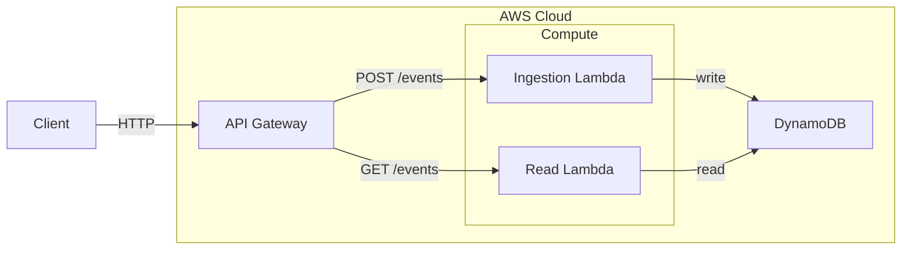

## Cloud Mapping

This section describes how logical components are realized using AWS services.
These mappings are implementation choices and may evolve independently from
the logical architecture.

| Logical Component | AWS Service |
|------------------|-------------|
| Ingestion Interface  | API Gateway + Lambda|
| Read Interface   | API Gateway + Lambda|
| Persistence      | DynamoDB |

---

## AWS System Architecture Map

## Persistence Mapping

The logical Persistence Component is mapped to Amazon DynamoDB.

DynamoDB is chosen to support the durability, immutability and
idempotency guarantees defined by the Service Contract.

This document does not describe table schemas or access patterns.

Detailed storage design is documented in:
- [Persistence Component – DynamoDB](../components/dynamodb.md)

---

## Ingestion Interface Mapping

The Ingestion Interface is implemented using AWS API Gateway
and an AWS Lambda function.

- [API Gateway](../components/api-gateway.md)
- [Ingestion Lambda](../components/ingestion-lambda.md)

## Read Interface Mapping

The Read Interface is implemented using AWS API Gateway
and an AWS Lambda function.

- [API Gateway](../components/api-gateway.md)
- [Read Lambda](../components/read-lambda.md)
