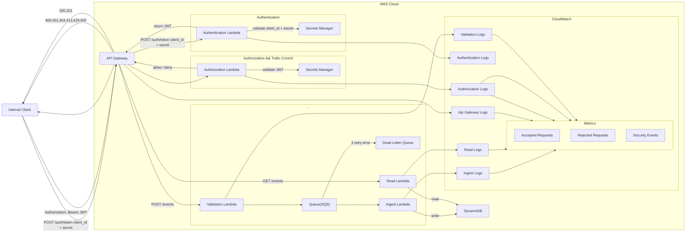

## Cloud Mapping

This section describes how logical components are realized using AWS services.
These mappings are implementation choices and may evolve independently from
the logical architecture.

| Logical Component               | AWS Service / Feature                                                   |
| ------------------------------- | ----------------------------------------------------------------------- |
| Ingestion Interface     |  API Gateway + Validation Lambda + SQS Queue + Ingest Lambda + DLQ |
| Read Interface          | API Gateway  + Lambda (Input Validation) |
| Persistence                     | DynamoDB                                                                |
| Monitoring / Logging            | CloudWatch (Log Groups, Metrics)                                        |
| Authentication Interface        | API Gateway + Auth Lambda (JWT Issuer) + Secrets Manager               |
| Authorization & Traffic Control | API Gateway(Rate Limiting / Throttling) + Lambda Authorizer (JWT Validator) + Secrets manager |

---

## AWS System Architecture Map

```mermaid
flowchart LR
    Client["Internal Client"]

    subgraph AWS["AWS Cloud"]

        %% Single API Gateway
        APIGW["API Gateway"]
        
        ASM["Secrets Manager"]

        %% --- Authentication Flow ---
        subgraph AuthFlow["Authentication"]
            JWTI["Authentication Lambda"]
            ASM["Secrets Manager"]
        end

        %% --- Authorization Flow ---
        subgraph AuthoFlow["Authorization && Trafic Control"]
            LAW["Authorization Lambda"]
            ASMB["Secrets Manager"]

        end

        %% --- Business Flow ---
        subgraph BizFlow["-"]
            Validation["Validation Lambda"]
            SQS["Queue(SQS)"]
            Ingest["Ingest Lambda"]
            DLQ["Dead Letter Queue"]
            Read["Read Lambda"]
        end

        %% Database
        DB["DynamoDB"]

        %% Logging & Metrics
        subgraph Monitoring["CloudWatch"]
            LGSec["Api Gateway Logs"]
            LGAuthentication["Authentication Logs"]
            LGAuthorization["Authorization Logs"]
            LG1["Ingest Logs"]
            LG2["Read Logs"]
            LG3["Validation Logs"]

            subgraph Metrics["Metrics"]
                Accepted["Accepted Requests"]
                Rejected["Rejected Requests"]
                SecurityEvents["Security Events"]
            end
        end

    end

    %% --- Authentication Flow ---
    Client -->|POST /auth/token client_id + secret | APIGW
    APIGW --> |POST /auth/token client_id + secret | JWTI
    JWTI -->|validate client_id + secret | ASM
    JWTI -->|return JWT| APIGW
    APIGW --> Client

    %% --- Authorization && traffic control ---
    APIGW --> LAW
    LAW --> | validate JWT | ASMB
    LAW -->|allow / deny| APIGW


    %% --- Business Flow ---
    Client -->|Authorization: Bearer JWT| APIGW


    %% Possible outcomes
    APIGW -->|400,401,404,413,429,500| Client
    APIGW -->|200,201| Client
    APIGW -->|POST /events| Validation
    APIGW -->|GET /events| Read

    %% Ingestion:
    Validation --> SQS --> Ingest
    SQS --> | 3 retry error | DLQ

    %% Database interactions
    Ingest -->|write| DB
    Read -->|read| DB

    %% Logging
    APIGW --> LGSec
    JWTI --> LGAuthentication
    LAW --> LGAuthorization
    Ingest --> LG1
    Read --> LG2
    Validation --> LG3
    %% Metrics
    LG1 --> Metrics
    LG2 --> Metrics
    LGSec --> Metrics
    LGAuthorization --> Metrics
    LGAuthorization --> Metrics
    LG3 --> Metrics
```

## Persistence Mapping

The logical Persistence Component is mapped to Amazon DynamoDB.

DynamoDB is chosen to support durability, immutability, and idempotency guarantees defined by the Service Contract. 

- Ingest Lambda uses DynamoDB to store processed event data and to track event IDs for idempotency.
- This ensures that repeated or retried messages do not result in duplicate processing.

Detailed storage design is documented in:
- [Persistence Component – DynamoDB](../components/dynamodb.md)

---

## Ingestion Interface Mapping

The Ingestion Interface is implemented using AWS API Gateway, a Validation Lambda, SQS queue, and an Ingest Lambda function.

- [API Gateway](../components/api-gateway.md)
- [Validation Lambda](../components/validation-lambda.md)
- [SQS Queue](../components/sqs.md)
- [Ingest Lambda](../components/ingest-lambda.md)
- [DLQ](../components/sqs-dlq.md)

## Read Interface Mapping

The Read Interface is implemented using AWS API Gateway
and an AWS Lambda function.

- [API Gateway](../components/api-gateway.md)
- [Read Lambda](../components/read-lambda.md)

## Monitoring / Logging Mapping

The Monitoring and Logging component uses Amazon CloudWatch to collect metrics and logs, providing visibility into system health and performance.

- [CloudWatch](../components/cloudwatch.md)

## Authentication Interface
The authentication component is implemented using AWS API Gateway, AWS lambda and AWS Secrets Manager
- [API Gateway](../components/api-gateway.md)
- [Authentication Lambda](../components/authentication-lambda.md)

## Authorization & Traffic Control
The authorization and traffic control is implemented using AWS API Gateway, AWS lambda and Secrets Manager
- [API Gateway](../components/api-gateway.md)
- [Authorization Lambda](../components/authorization-lambda.md)